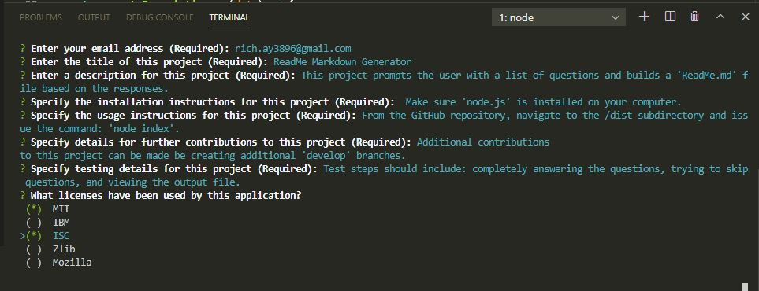

# Readme Generator

Richard Ay, September 2020

## Table of Contents
* [Project Objective](#project-objective)
* [Acceptance Criteria](#acceptance-criteria)
* [Deployment Link](#deployment-link)
* [Application Logic](#application-logic)
* [Technologies Used](#technologies-used)
* [Application Screen Shot](#application-screen-shot)

## Project Objective
As a developer, I want a README generator so that I can quickly create a professional README for a new project.

## Acceptance Criteria
GIVEN a command-line application that accepts user input:

1) WHEN I am prompted for information about my application repository, THEN a high-quality, professional README.md is generated with the title of my project and sections entitled Description, Table of Contents, Installation, Usage, 
License, Contributing, Tests, and Questions.
2) WHEN I enter my project title, THEN this is displayed as the title of the README.
3) WHEN I enter a description, installation instructions, usage information, contribution guidelines, and test instructions, THEN this information is added to the sections of the README entitled Description, Installation, Usage, Contributing, and Tests.
4) WHEN I choose a license for my application from a list of options, THEN a badge for that license is added near the top of the README and a notice is added to the section of the README entitled License that explains which license the application is covered under.
5) WHEN I enter my GitHub username, THEN this is added to the section of the README entitled Questions, with a link to my GitHub profile.
6) WHEN I enter my email address, THEN this is added to the section of the README entitled Questions, with instructions on how to reach me with additional questions.
7) WHEN I click on the links in the Table of Contents, THEN I am taken to the corresponding section of the README.

## Deployment Link
The deployment link to display the application is: 
[GitHub Pages](https://captainrich.github.io/Readme-Generator/) 

## Application Logic

1) On start-up, the user is presented with a series of prompts related to the generation of a 'readme.md' file.  The prompts are displayed and the user's answers saved using the node.js module 'inquirer'.
2) After all of the prompts have been answered, the node.js module 'file system' is used to write the information to the 'readme.md' file. 

## Technologies Used

1) JavaScript
2) Node.js (including 'inquirer' and 'file system')
3) The ISC license is used for this application: 

## Application Results

The generated 'readme.md' file and a usage video can be found in the '/dist' subdirectory.  A typical use of the application is shown in the screen capture below.

